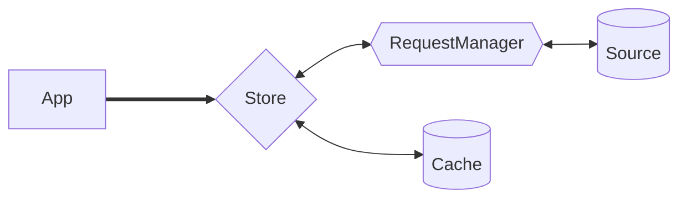
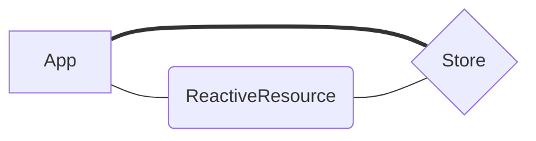

***Warp*Drive** is the lightweight data library for web apps: universal, typed, reactive, and
ready to scale. This package is its core: the [Store](classes/Store.md) that holds
your data, the [RequestManager](classes/RequestManager.md) that fetches it through a
chain of handlers (each a function or object that can fulfill, modify, or pass along a request),
the [Cache](/api/@warp-drive/core/types/cache/types/Cache) interface a cache implementation
fills in, and the reactive objects that present cached data to your UI.

:::tip New here?
Start with the [Installation](/guides/installation/) and [Setup](/guides/configuration/) guides.
The API docs assume that context.
:::

## How the Pieces Connect

Your app talks to the Store. The Store keeps resource data in the Cache and hands requests to the
RequestManager, whose handlers fetch data from a source such as your API or a local persistence
layer.



The Store also presents cached data to your app as reactive records. It creates each record with
its [instantiateRecord](classes/Store.md#instantiaterecord) hook; the Store that
`useRecommendedStore` produces presents every resource as a
[ReactiveResource](/api/@warp-drive/core/reactive/types/ReactiveResource).



## Setup

[useRecommendedStore](functions/useRecommendedStore.md) produces a Store class with the
recommended defaults for schema handling, reactivity, caching, and request management, including a
RequestManager already wired with `Fetch` and `CacheHandler`. Pair it with a
cache implementation; most apps should use [@warp-drive/json-api](../json-api/index.md).

```ts
import { useRecommendedStore } from '@warp-drive/core';
import { JSONAPICache } from '@warp-drive/json-api';

export const AppStore = useRecommendedStore({
  cache: JSONAPICache,
  schemas: [
    // one schema per resource type, see /guides/the-manual/schemas/
  ],
});
```

`AppStore` is a class. The [Setup guide](/guides/configuration/) shows how each framework
instantiates it and makes it available to components, and how to configure the
[build plugin](/api/@warp-drive/core/build-config/) every ***Warp*Drive** app needs. Schemas
describe the shape of your resources; the [Schemas guide](/guides/the-manual/schemas/) covers
writing them.

## Entry Points

* `@warp-drive/core`: the Store, RequestManager, the `Fetch` handler that performs the network
  request and the `CacheHandler` that reads and writes the cache, and `useRecommendedStore`.
* [`@warp-drive/core/request`](/api/@warp-drive/core/request/): request and handler primitives,
  such as `withResponseType`.
* [`@warp-drive/core/reactive`](/api/@warp-drive/core/reactive/): the reactive objects a Store
  uses to present requests, resources, and relationships from the cache.
* [`@warp-drive/core/store`](/api/@warp-drive/core/store/): the pieces for customizing a Store
  beyond the recommended defaults, such as the cache policy that decides when cached data is stale.
* [`@warp-drive/core/types`](/api/@warp-drive/core/types/): the types, type utilities, symbols and
  constants shared across the ***Warp*Drive** ecosystem, including the Cache interface.
* [`@warp-drive/core/build-config`](/api/@warp-drive/core/build-config/): the build plugin that
  configures deprecations, optional features, and debug logging.
* [`@warp-drive/core/configure`](/api/@warp-drive/core/configure/): the API for telling
  ***Warp*Drive** which framework's reactivity system to use.

## Guides

* [Installation](/guides/installation/): install `@warp-drive/core`, a cache and the reactivity
  package for your framework.
* [Setup](/guides/configuration/): configure the build plugin and create a Store with
  `useRecommendedStore`.
* [Advanced Store Configuration](/guides/configuration/advanced.md): build a Store class by hand,
  one piece at a time.
* [Making Requests](/guides/the-manual/requests/): `store.request`, request options and the
  handler chain.
* [Builders](/guides/the-manual/requests/builders.md): functions that return a request and a
  stable cache key.
* [Handlers](/guides/the-manual/requests/handlers.md): write a handler that transforms a response.
* [Auth Handler](/guides/the-manual/cookbook/auth-handlers.md): add JWT or CSRF tokens to outgoing
  requests with a handler.
* [Typing Requests](/guides/the-manual/requests/typing-requests.md): `withResponseType` and
  `withReactiveResponse`.
* [Using the Response](/guides/the-manual/requests/using-the-response.md): the `Future` a request
  returns, its errors and its content.
* [Schemas](/guides/the-manual/schemas/): how a schema turns cached data into reactive
  properties.
* [ResourceSchemas](/guides/the-manual/schemas/resources/): define a resource with `withDefaults`,
  choose its field kinds and register it.
* [SimpleFields](/guides/the-manual/schemas/simple-fields.md): declare primitive attributes as
  `field` kinds.
* [Complex Fields](/guides/the-manual/schemas/complex-fields.md): embed nested objects and lists
  with `schema-object` and `schema-array` fields.
* [ObjectSchemas](/guides/the-manual/schemas/object-schemas.md): define the identity-less schema
  a `schema-object` field points at.
* [Traits](/guides/the-manual/schemas/traits.md): share a group of fields across resources.
* [Transformations](/guides/the-manual/schemas/transformations.md): convert a field between its
  cache and app shapes.
* [Derivations](/guides/the-manual/schemas/derivations.md): define memoized, read-only `derived`
  fields.
* [Caching](/guides/the-manual/caching/): how the `CacheHandler` and the cache policy decide what
  to fetch and what to keep.
* [Key Terminology](/guides/the-manual/caching/key-terms.md): documents, resources and the names
  of their types.
* [Reactivity](/guides/the-manual/reactivity/): how ***Warp*Drive** uses signals to notify your UI.
* [Reactive Control Flow](/guides/the-manual/reactivity/control-flow.md): render a request's
  states with `getRequestState`.
* [Async as Reactive State](/guides/the-manual/reactivity/derivation.md): derive a promise's state
  with `getPromiseState`.
* [Relationships](/guides/the-manual/relational-data/): configure each kind of relationship.
* [Debugging](/guides/the-manual/debugging/): turn on debug logging at runtime or in the build
  config.
* [TypeScript](/guides/the-manual/typescript/): opt in to the alpha types, then follow the setup
  pages in order.

## Classes

* [ConfiguredStore](classes/ConfiguredStore.md)
* [RequestManager](classes/RequestManager.md)
* [Store](classes/Store.md)

## Variables

* [CacheHandler](variables/CacheHandler.md)
* [Fetch](variables/Fetch.md)

## Functions

### cacheKeyFor

Renames and re-exports [recordIdentifierFor](functions/recordIdentifierFor.md)

## Types

* [CachePolicy](types/CachePolicy.md)
* [StoreRequestContext](types/StoreRequestContext.md)
* [StoreSetupOptions](types/StoreSetupOptions.md)
* [CacheOperation](types/CacheOperation.md)
* [~~Document~~](types/Document.md)
* [DocumentCacheOperation](types/DocumentCacheOperation.md)
* [NotificationChannel](types/NotificationChannel.md)
* [NotificationType](types/NotificationType.md)
* [NotifyKeys](types/NotifyKeys.md)
* [StoreRequestInput](types/StoreRequestInput.md)
