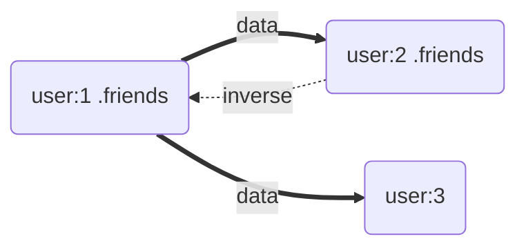

# Understanding "the Graph"

Relationship state is not stored on records. It lives in **the Graph**, a relational map owned by
the cache that stores one *edge* per `(resource, relationship field)` pair.

Each edge records:

- **remote state** — the membership last confirmed by the API,
- **local state** — the membership including unsaved changes,
- **links** and **meta** — copied verbatim from the last relationship payload,
- **definition** — the field's kind, `type`, `async`, `inverse` and polymorphism settings, upgraded
  once from your schema.

## Operations, Not Assignments

The Graph is driven by operations. A payload push becomes an `updateRelationship` operation that
replaces remote state. A local edit becomes an `add`, `remove`, `replaceRelatedRecord`,
`replaceRelatedRecords` or `sortRelatedRecords` operation against local state. Because every
change is an explicit operation, the Graph can:

- update the [inverse](../features/inverses.md) edge in the same step,
- compute a diff for saving (`changedRelationships`) and support rollback,
- notify only the records and fields that actually changed.

`resource` and `collection` fields are handled by the same edge types as `belongsTo` and
`hasMany`; the Graph converts them internally. The difference is at the edges of the system —
what the field's value looks like on a record, and that remote updates never discard local
changes for the new kinds.

## Remote vs Local Projections

A record reads its relationships as one of two projections of the edge:

| Record | Projection |
| --- | --- |
| LegacyMode record | local state |
| PolarisMode immutable record | remote state |
| PolarisMode checked-out record | local state |

This is why an immutable PolarisMode record does not show a change made on its checked-out copy
until the change is saved or committed, and why both copies share one source of truth.

## Notifications

When an edge changes the Graph notifies the store with the resource key and field name, tagged
with the channel (`'local'` or `'remote'`) that changed. Records subscribed to that channel mark the
relationship document's `data`, `links` and `meta` (and, for collections, the backing array) as
stale; the next read recomputes from the edge. Nothing is copied eagerly, and the document and
array instances stay the same.

## Relationship Payloads Replace, Fields Upsert

The Graph applies **upsert** semantics at the relationship level but **replace** semantics for each
of `data`, `links` and `meta` within a relationship payload. A payload that omits `data` leaves the
membership untouched; a payload with `data: []` empties it. This makes partial resource payloads
safe while keeping relationship membership unambiguous. See the
[caching guide](../../caching/index.md#relationships-are-cached-by-resourcekey-fieldname).
