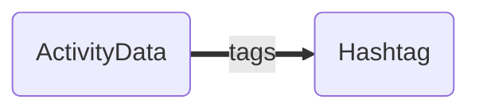

# Many To None Relationships

Imagine our social network for trail runners 🏃🏃🏾‍♀️ allows runners to tag their activities. [#runday](https://www.instagram.com/explore/tags/runday/?hl=en) [#justdoit](https://www.instagram.com/explore/tags/justdoit/?hl=en)

In this model, the ActivityData might have multiple tags, but given that millions if not billions if not trillions of activities might use a tag like [#neverstopexploring](https://www.instagram.com/explore/tags/neverstopexploring/?hl=en), it turns out we definitely don't want the tag to keep track of every activity that ever referenced it.



> **Note** In our charts we use dotted lines for singular relationships and thick solid lines for collection relationships.

Often `ManyToNone` is used for exactly this sort of case, where conceptually the relationship is [many-to-many](./many-to-many.md) in nature, but one side would be so large that modeling it as such is prohibitive.

- [Defining the Relationship](#defining-the-relationship)
- [Using the Schema DSL (draft)](#using-the-schema-dsl-draft)
- [Legacy `belongsTo` and `hasMany`](#legacy-belongsto-and-hasmany)

---

## Defining the Relationship

Declare a `collection` field on the side that points at the others, with `inverse: null`. These field kinds behave the same in LegacyMode and PolarisMode; [ResourceSchemas](../../schemas/resources/index.md) shows how to register the schemas they belong to, and [Inverses and Directionality](../features/inverses.md) explains `inverse`.

🏃🏾‍♀️ *ActivityData*

```ts
{
  kind: 'collection',
  name: 'tags',
  type: 'hashtag',
  options: { async: false, inverse: null },
}
```

::: warning Keep the "many" side small
A `collection` field always holds the complete list. If the list could grow large, or users would page, sort or filter it, load it with a top-level request instead; see [Large Collections](../advanced/large-collections.md).
:::

---

## Using the Schema DSL (draft)

Working with schemas in a raw json format is far more flexible, lightweight and
performant than working with bulky classes that need to be shipped across the wire, parsed, and instantiated. Even relatively small apps can quickly find themselves shipping large quantities of JS just to describe their data.

No one wants to author schemas in raw JSON though (we hope 😬), and the ergonomics of typed data and editor autocomplete based on your schemas are vital to productivity and
code quality. For this, we offer a way to express schemas as TypeScript using types, classes and decorators which are then compiled into json schemas and TypeScript interfaces for use by your project.

The [Schema DSL](../../schemas/dsl/index.md) (`@warp-drive/schema-dsl`) provides this. Decorators for `resource` and `collection` fields are planned; until they land, the DSL can declare this relationship only with its legacy decorators, shown in [Schema DSL (legacy)](#schema-dsl-legacy) below.

---

## Legacy `belongsTo` and `hasMany`

The legacy kinds are kept for apps migrating from `@warp-drive/legacy/model`. To move them to the fields above, see [Migrating Relationships to resource and collection](/upgrading/v5/relationships.md).

### Schema Fields

In a [LegacyMode](../../schemas/resources/legacy-mode.md) `ResourceSchema`, where `withDefaults` sets `legacy: true`, adds the `id` identity field, and appends the derived and local fields that emulate `Model`:

🏃🏾‍♀️ *ActivityData*

```ts
import { withDefaults } from '@warp-drive/legacy/model/migration-support';

export const ActivityDataSchema = withDefaults({
  type: 'activity-data',
  fields: [
    {
      kind: 'hasMany',
      name: 'tags',
      type: 'hashtag',
      options: { async: false, inverse: null },
    },
  ],
});
```

🏷️ *Hashtag*

```ts
import { withDefaults } from '@warp-drive/legacy/model/migration-support';

export const HashtagSchema = withDefaults({
  type: 'hashtag',
  fields: [],
});
```

If you did not create the store with `useLegacyStore`, call `registerDerivations` once on the schema service, as shown in [Configuration](../../schemas/resources/legacy-mode.md#configuration). [Defining Legacy Schemas](../../schemas/resources/legacy-mode.md#defining-legacy-schemas) shows how to type the records these schemas produce.

### `@warp-drive/legacy/model`

With `Model` classes, the `SchemaService` provided by `@warp-drive/legacy/model` converts the decorators into the schema fields above at runtime.

🏃🏾‍♀️ *ActivityData*

```ts
import Model, { hasMany } from '@warp-drive/legacy/model';

export default class ActivityData extends Model {
  @hasMany('hashtag', { async: false, inverse: null })
  tags;
}
```

🏷️ *Hashtag*

```ts
import Model from '@warp-drive/legacy/model';

export default class Hashtag extends Model {}
```

### Schema DSL (legacy) {#schema-dsl-legacy}

The Schema DSL's `@belongsTo` and `@hasMany` compile to the schema fields above and are only valid on resources decorated with `@Resource({ legacy: true })`.

🏃🏾‍♀️ *ActivityData*

```ts
import { Resource, hasMany } from '@warp-drive/schema-dsl';

@Resource('activity-data', { legacy: true })
export class ActivityData {
  @hasMany({ type: 'hashtag', inverse: null, async: false })
  declare tags: unknown;
}
```
