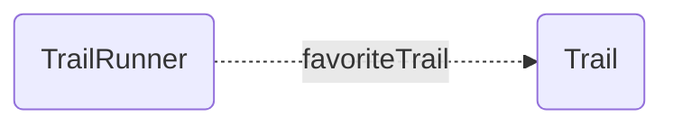

# One To None Relationships

Pretend we're building a social network for trail runners 🏃🏃🏾‍♀️, and a TrailRunner (maybe [@runspired](https://github.com/runspired)) can have a favorite Trail to run on . While the TrailRunner has a favorite trail, the trail has no concept of a TrailRunner.



> **Note** In our charts we use dotted lines for singular relationships and thick solid lines for collection relationships.

Such a relationship is singular and unidirectional (it only points to one resource, and only points in one direction).
When a relationship only points in one direction, we say it has no [inverse](../features/inverses.md).

You'll note that effectively this setup implicitly indicates a "many" relationship. A Trail "implicitly" has many runners (for whom it is their favorite trail).

Internally, WarpDrive will keep track of this implicit relationship such that if the trail were to be destroyed in a landslide its deletion would result in removing it as the favoriteTrail for each associated runner.

Implicit relationships are not available as a public API, because they represent a highly incomplete view of the data, but the book-keeping produces benefits such as
the ability to efficiently disassociate the record from relationships when it is destroyed.

- [Defining the Relationship](#defining-the-relationship)
- [Using the Schema DSL (draft)](#using-the-schema-dsl-draft)
- [Legacy `belongsTo` and `hasMany`](#legacy-belongsto-and-hasmany)

---

## Defining the Relationship

Declare a `resource` field on the side that points at the other, with `inverse: null`. These field kinds behave the same in LegacyMode and PolarisMode; [ResourceSchemas](../../schemas/resources/index.md) shows how to register the schemas they belong to, and [Inverses and Directionality](../features/inverses.md) explains `inverse`.

🌲 *TrailRunner*

```ts
{
  kind: 'resource',
  name: 'favoriteTrail',
  type: 'trail',
  options: { async: false, inverse: null },
}
```

---

## Using the Schema DSL (draft)

Working with schemas in a raw json format is far more flexible, lightweight and
performant than working with bulky classes that need to be shipped across the wire, parsed, and instantiated. Even relatively small apps can quickly find themselves shipping large quantities of JS just to describe their data.

No one wants to author schemas in raw JSON though (we hope 😬), and the ergonomics of typed data and editor autocomplete based on your schemas are vital to productivity and
code quality. For this, we offer a way to express schemas as TypeScript using types, classes and decorators which are then compiled into json schemas and TypeScript interfaces for use by your project.

The [Schema DSL](../../schemas/dsl/index.md) (`@warp-drive/schema-dsl`) provides this. Decorators for `resource` and `collection` fields are planned; until they land, the DSL can declare this relationship only with its legacy decorators, shown in [Schema DSL (legacy)](#schema-dsl-legacy) below.

---

## Legacy `belongsTo` and `hasMany`

The legacy kinds are kept for apps migrating from `@warp-drive/legacy/model`. To move them to the fields above, see [Migrating Relationships to resource and collection](/upgrading/v5/relationships.md).

### Schema Fields

In a [LegacyMode](../../schemas/resources/legacy-mode.md) `ResourceSchema`, where `withDefaults` sets `legacy: true`, adds the `id` identity field, and appends the derived and local fields that emulate `Model`:

🌲 *TrailRunner*

```ts
import { withDefaults } from '@warp-drive/legacy/model/migration-support';

export const TrailRunnerSchema = withDefaults({
  type: 'trail-runner',
  fields: [
    {
      kind: 'belongsTo',
      name: 'favoriteTrail',
      type: 'trail',
      options: { async: false, inverse: null },
    },
  ],
});
```

⛰️ *Trail*

```ts
import { withDefaults } from '@warp-drive/legacy/model/migration-support';

export const TrailSchema = withDefaults({
  type: 'trail',
  fields: [],
});
```

If you did not create the store with `useLegacyStore`, call `registerDerivations` once on the schema service, as shown in [Configuration](../../schemas/resources/legacy-mode.md#configuration). [Defining Legacy Schemas](../../schemas/resources/legacy-mode.md#defining-legacy-schemas) shows how to type the records these schemas produce.

### `@warp-drive/legacy/model`

With `Model` classes, the `SchemaService` provided by `@warp-drive/legacy/model` converts the decorators into the schema fields above at runtime.

🌲 *TrailRunner*

```ts
import Model, { belongsTo } from '@warp-drive/legacy/model';

export default class TrailRunner extends Model {
  @belongsTo('trail', { async: false, inverse: null })
  favoriteTrail;
}
```

⛰️ *Trail*

```ts
import Model from '@warp-drive/legacy/model';

export default class Trail extends Model {}
```

### Schema DSL (legacy) {#schema-dsl-legacy}

The Schema DSL's `@belongsTo` and `@hasMany` compile to the schema fields above and are only valid on resources decorated with `@Resource({ legacy: true })`.

🌲 *TrailRunner*

```ts
import { Resource, belongsTo } from '@warp-drive/schema-dsl';

@Resource('trail-runner', { legacy: true })
export class TrailRunner {
  @belongsTo({ type: 'trail', inverse: null, async: false })
  declare favoriteTrail: unknown;
}
```
