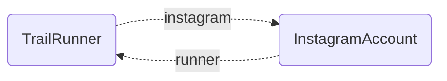
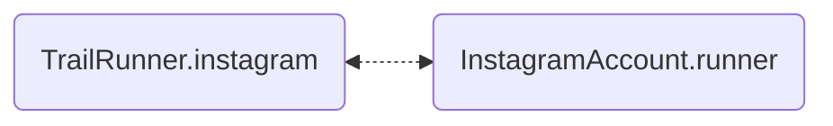
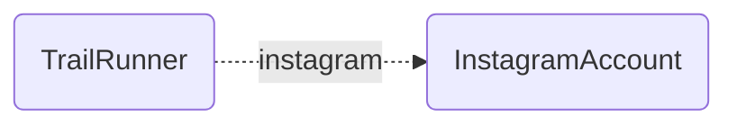
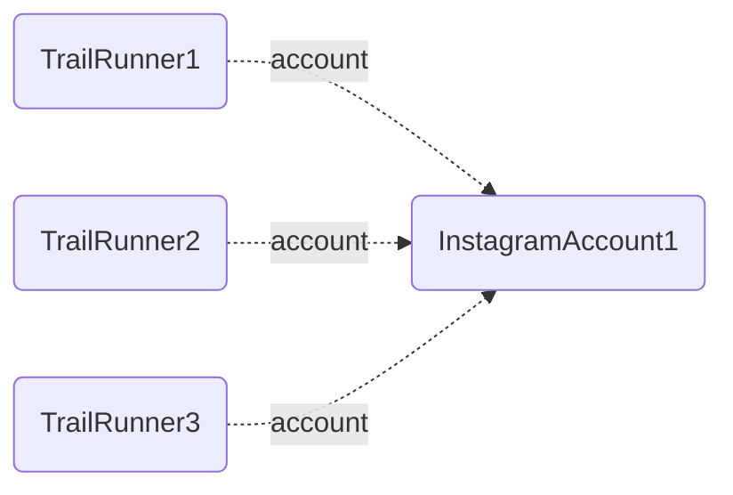
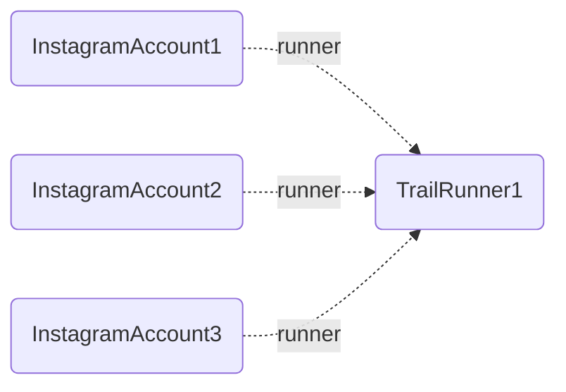

# One To One Relationships

Imagine our social network for trail runners 🏃🏃🏾‍♀️ allows runners to add their other social accounts. For instance, the TrailRunner [@runspired](https://github.com/runspired) might add their Instagram account.

Here, the coupling goes both ways. In this model, the 📸 Instagram account can only belong to one Trail Runner, and the Trail Runner only has one Instagram Account. Let's take a selfie:



There are two ways we can model this relationship: bidirectionally with managed [inverses](../features/inverses.md), or unidirectionally without managed inverses.

In the bidirectional configuration, changes to one side of the relationship change the other side as well. This includes
both updates from remote state (a payload for the resource received from the API) as well as mutations to the local state
(application code setting a new, unsaved value for the relationship).



> **Note** In our charts we use dotted lines for singular relationships and thick solid lines for collection relationships.

In the unidirectional configuration, we effectively have two separate distinct [one-to-none](./one-to-none.md) relationships.




With distinct relationships, we may edit one side without affecting the state of the inverse.

Note, modeling this setup as two "one-to-none" relationships has the advantage of creating an implicit "many" relationship in both directions. Imagine that many runners could have the same instagram account and that at the same time many instagram accounts could belong to the same runner.

You might be tempted to think of this as a [many-to-many](./many-to-many.md) or two [many-to-none](./many-to-one.md), but sometimes this is effectively modeled as two `one-to-none` relationships.






Head over to [one-to-none](./one-to-none.md) if this is the setup that is best for you.

- [Defining the Relationship](#defining-the-relationship)
- [Using the Schema DSL (draft)](#using-the-schema-dsl-draft)
- [Legacy `belongsTo` and `hasMany`](#legacy-belongsto-and-hasmany)

---

## Defining the Relationship

Declare a `resource` field on each side, each naming the other as its `inverse`. These field kinds behave the same in LegacyMode and PolarisMode; [ResourceSchemas](../../schemas/resources/index.md) shows how to register the schemas they belong to, and [Inverses and Directionality](../features/inverses.md) explains `inverse`.

📸 *InstagramAccount*

```ts
{
  kind: 'resource',
  name: 'runner',
  type: 'trail-runner',
  options: { async: false, inverse: 'instagram' },
}
```

🌲 *TrailRunner*

```ts
{
  kind: 'resource',
  name: 'instagram',
  type: 'instagram-account',
  options: { async: false, inverse: 'runner' },
}
```

---

## Using the Schema DSL (draft)

Working with schemas in a raw json format is far more flexible, lightweight and
performant than working with bulky classes that need to be shipped across the wire, parsed, and instantiated. Even relatively small apps can quickly find themselves shipping large quantities of JS just to describe their data.

No one wants to author schemas in raw JSON though (we hope 😬), and the ergonomics of typed data and editor autocomplete based on your schemas are vital to productivity and
code quality. For this, we offer a way to express schemas as TypeScript using types, classes and decorators which are then compiled into json schemas and TypeScript interfaces for use by your project.

The [Schema DSL](../../schemas/dsl/index.md) (`@warp-drive/schema-dsl`) provides this. Decorators for `resource` and `collection` fields are planned; until they land, the DSL can declare this relationship only with its legacy decorators, shown in [Schema DSL (legacy)](#schema-dsl-legacy) below.

---

## Legacy `belongsTo` and `hasMany`

The legacy kinds are kept for apps migrating from `@warp-drive/legacy/model`. To move them to the fields above, see [Migrating Relationships to resource and collection](/upgrading/v5/relationships.md).

### Schema Fields

In a [LegacyMode](../../schemas/resources/legacy-mode.md) `ResourceSchema`, where `withDefaults` sets `legacy: true`, adds the `id` identity field, and appends the derived and local fields that emulate `Model`:

📸 *InstagramAccount*

```ts
import { withDefaults } from '@warp-drive/legacy/model/migration-support';

export const InstagramAccountSchema = withDefaults({
  type: 'instagram-account',
  fields: [
    {
      kind: 'belongsTo',
      name: 'runner',
      type: 'trail-runner',
      options: { async: false, inverse: 'instagram' },
    },
  ],
});
```

🌲 *TrailRunner*

```ts
import { withDefaults } from '@warp-drive/legacy/model/migration-support';

export const TrailRunnerSchema = withDefaults({
  type: 'trail-runner',
  fields: [
    {
      kind: 'belongsTo',
      name: 'instagram',
      type: 'instagram-account',
      options: { async: false, inverse: 'runner' },
    },
  ],
});
```

If you did not create the store with `useLegacyStore`, call `registerDerivations` once on the schema service, as shown in [Configuration](../../schemas/resources/legacy-mode.md#configuration). [Defining Legacy Schemas](../../schemas/resources/legacy-mode.md#defining-legacy-schemas) shows how to type the records these schemas produce.

### `@warp-drive/legacy/model`

With `Model` classes, the `SchemaService` provided by `@warp-drive/legacy/model` converts the decorators into the schema fields above at runtime.

📸 *InstagramAccount*

```ts
import Model, { belongsTo } from '@warp-drive/legacy/model';

export default class InstagramAccount extends Model {
  @belongsTo('trail-runner', { async: false, inverse: 'instagram' })
  runner;
}
```

🌲 *TrailRunner*

```ts
import Model, { belongsTo } from '@warp-drive/legacy/model';

export default class TrailRunner extends Model {
  @belongsTo('instagram-account', { async: false, inverse: 'runner' })
  instagram;
}
```

### Schema DSL (legacy) {#schema-dsl-legacy}

The Schema DSL's `@belongsTo` and `@hasMany` compile to the schema fields above and are only valid on resources decorated with `@Resource({ legacy: true })`.

📸 *InstagramAccount*

```ts
import { Resource, belongsTo } from '@warp-drive/schema-dsl';

@Resource('instagram-account', { legacy: true })
export class InstagramAccount {
  @belongsTo({ type: 'trail-runner', inverse: 'instagram', async: false })
  declare runner: unknown;
}
```

🌲 *TrailRunner*

```ts
import { Resource, belongsTo } from '@warp-drive/schema-dsl';

@Resource('trail-runner', { legacy: true })
export class TrailRunner {
  @belongsTo({ type: 'instagram-account', inverse: 'runner', async: false })
  declare instagram: unknown;
}
```
