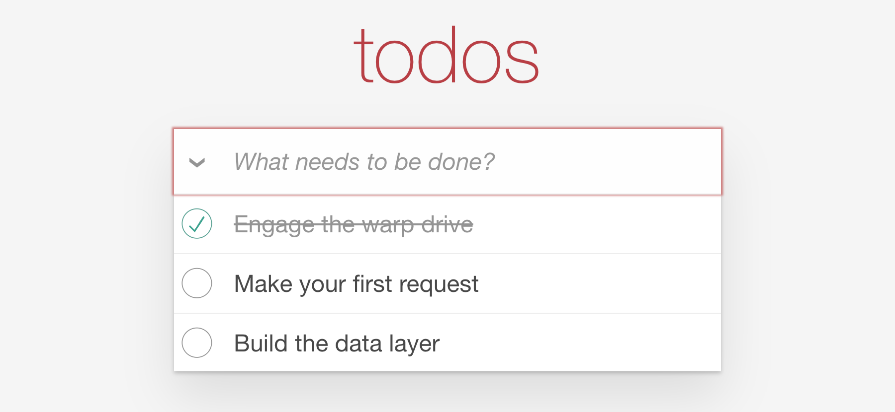

# First request

The list is empty because nothing asks the API for todos. Let's fix that. By the
end of this chapter three todos are on screen, and it takes two edits.

## Request the todos

Open `app/routes/index.ts` and replace the `TODO (chapter 1)` comment:

```ts
model(): { todos?: Future<TodosDocument> } {
  return {
    todos: this.store.request<TodosDocument>({ url: '/api/todo' }),
  };
}
```

`store.request` returns a `Future` right away, without waiting for the response.
The route hands it to the page, and the page decides what to show while it
loads.

## Render the response

Open `app/components/todo-app/todo-provider.gts` and replace its
`TODO (chapter 1)` comment with a `<Request>` block:

```handlebars
<Request @request={{@todoFuture}} @autorefresh={{true}} @autorefreshBehavior="refresh">

  <:loading><LoadingSpinner /></:loading>

  <:content as |content|>
    <TodoListState @todos={{content.data}}>
      <:toggle as |list|>{{yield list to="toggle"}}</:toggle>
      <:list as |list|>{{yield list to="list"}}</:list>
    </TodoListState>
  </:content>

  <:error as |error|>{{this.appState.onUnrecoverableError error}}</:error>

</Request>
```

`<Request>` takes the `Future` and renders `<:loading>`, `<:content>` or
`<:error>`, depending on where the request is. The todos are `content.data`. The
two `@autorefresh` arguments refetch in the background when the request goes
stale, which chapter 4 relies on.

## Check it

Reload. Three todos.



Nothing else works yet, and the footer is missing. Each chapter adds a piece.

::: tip
Don't click Active or Completed yet. Their routes request nothing until
chapter 3, so they show an error for now.
:::

Next, a short look at why that took so little code.
