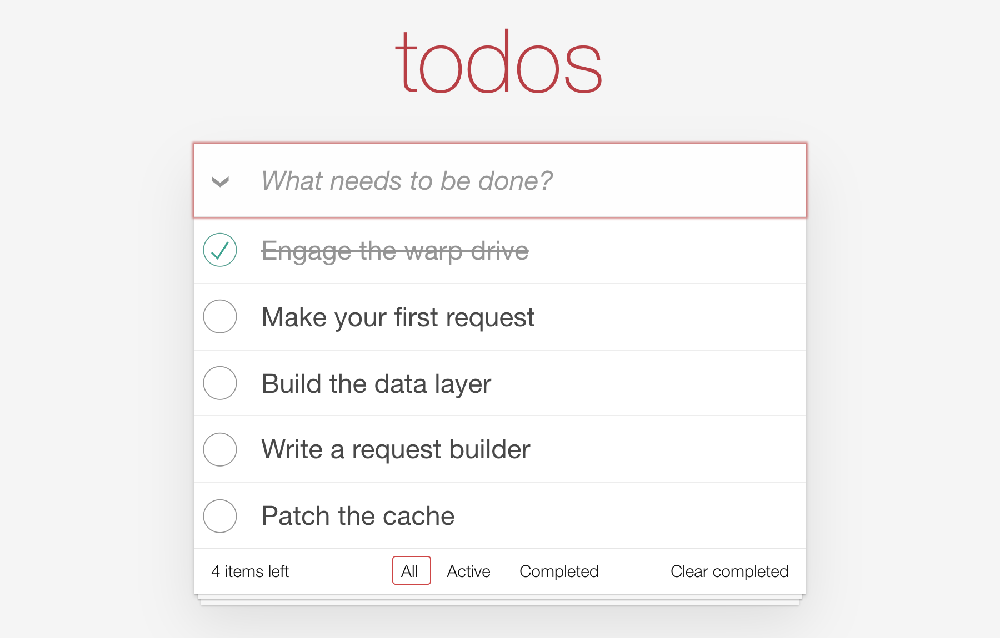

# TodoMVC

Let's build the data layer of a TodoMVC app with ***Warp*Drive**.

The starter ships the Ember UI and a local API. You write the ***Warp*Drive**
part: requests, builders, one handler and a few cache updates. No models,
adapters or serializers. Your first request renders todos in chapter 1, and each
chapter after that adds one operation.



## Chapters

|     | Chapter                                             | You'll use                                 |
| --- | --------------------------------------------------- | ------------------------------------------ |
| 1   | [First request](./first-request.md)                 | `store.request` and `<Request>`            |
| 2   | [Why that worked](./why-that-worked.md)             | the store, the request pipeline, a schema  |
| 3   | [Request builders](./request-builders.md)           | builders and a handler                     |
| 4   | [Create](./create.md)                               | `createRecord` and invalidation            |
| 5   | [Edit title](./edit-title.md)                       | `checkout` and `updateRecord`              |
| 6   | [Toggle](./toggle.md)                               | `store.cache.patch`                        |
| 7   | [Delete](./delete.md)                               | `deleteRecord`                             |
| 8   | [Bulk operations](./bulk-operations.md), optional   | bulk requests, then where to go next       |

## Before you start

You should know TypeScript and have built something with Ember. You don't need
to know ***Warp*Drive**.

You need Node.js and [pnpm](https://pnpm.io/).

## Get the starter

```sh
npx @warp-drive/tutorials@canary todomvc-ember
cd todomvc-ember
pnpm install
pnpm start
```

Open the URL Vite prints. You should see the TodoMVC header and the filters,
with no todos between them. That's right: nothing requests todos until
chapter 1.


## What's in the starter

```
todomvc-ember/
  api-worker/     the API, in a service worker; you won't touch it
  app/
    components/   the TodoMVC UI, finished
    data/
      builders/   you write these, next to a shipped utils.ts
      schemas/    the todo schema, finished
      store.ts    the store, finished
    routes/       one per filter: all, active, completed
```

The Ember side is done. Each chapter tells you what to write and where.

## The API

The app talks to a JSON:API server at `/api`. It runs in the browser as a
service worker, so there's nothing to start, and it keeps your changes across
reloads. It begins with three todos. To reset it, clear the site data in your
browser's developer tools.
