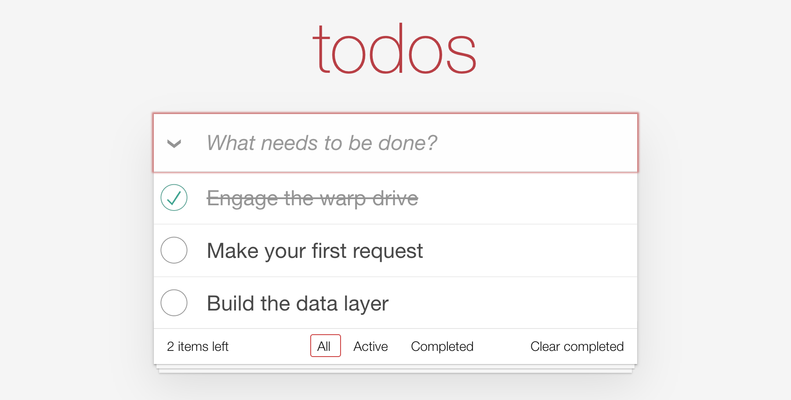

# Request builders

The Active and Completed pages need their own lists, and so does the footer.
Rather than write the same request in five places, let's write it once as a
builder. By the end of this chapter the whole footer works.

A builder is a plain function that returns a request. It sends nothing. You pass
its result to `store.request`, or to `<Request>`.

## Write the builders

Create `app/data/builders/query.ts`:

```ts
import { withReactiveResponse } from '@warp-drive/core/request';
import type { RequestInfo } from '@warp-drive/core/types/request';
import { buildBaseURL, buildQueryParams } from '@warp-drive/utilities';

import type { Todo, TodosDocument } from '../schemas/todo.ts';

function queryTodos(filter?: { completed: boolean }): RequestInfo<TodosDocument> {
  const url = buildBaseURL({ resourcePath: 'todo' });
  const query = filter ? `?${buildQueryParams({ 'filter[completed]': filter.completed })}` : '';

  return withReactiveResponse<Todo[]>({
    method: 'GET',
    url: `${url}${query}`,
    headers: new Headers({ Accept: 'application/vnd.api+json' }),

    // 'query' requests for the 'todo' type are invalidated whenever a todo is
    // created, so every list refetches and picks up the new todo.
    op: 'query',
    cacheOptions: { types: ['todo'] },
  });
}

/** GET /api/todo */
export function getAllTodos(): RequestInfo<TodosDocument> {
  return queryTodos();
}

/** GET /api/todo?filter[completed]=false */
export function getActiveTodos(): RequestInfo<TodosDocument> {
  return queryTodos({ completed: false });
}

/** GET /api/todo?filter[completed]=true */
export function getCompletedTodos(): RequestInfo<TodosDocument> {
  return queryTodos({ completed: true });
}
```

Two lines to notice:

- `withReactiveResponse<Todo[]>` records the response type on the request, so
  callers don't have to. Chapter 1 wrote `store.request<TodosDocument>` for that.
- `op: 'query'` with `cacheOptions: { types: ['todo'] }` registers the request
  as a list of todos. Chapter 4 uses that to refetch every list when a todo is
  created.

## Use them in the routes

Open `app/routes/index.ts` and replace chapter 1's request:

```ts
import { getAllTodos } from '#app/data/builders/query.ts';

// ...

todos: this.store.request(getAllTodos()),
```

Do the same at the `TODO (chapter 3)` comments in `app/routes/active.ts` and
`app/routes/completed.ts`, with `getActiveTodos` and `getCompletedTodos`.

## Use them in the footer

The footer has three `TODO (chapter 3)` comments. Each passes a builder to
`<Request>` as `@query`, and `<Request>` calls `store.request` for you.

In `app/components/todo-app/footer.gts`, show the footer once there are todos:

```handlebars
<Request @query={{(getAllTodos)}} @autorefresh={{true}} @autorefreshBehavior="refresh">

  <:content as |content|>
    {{#if content.data.length}}
      <footer class="footer">
        {{yield}}
      </footer>
    {{/if}}
  </:content>

  <:error as |error|>
    <HandleError @error={{error}} />
  </:error>

</Request>
```

In `app/components/todo-app/todo-count.gts`, count the active todos:

```handlebars
<Request @query={{(getActiveTodos)}} @autorefresh={{true}} @autorefreshBehavior="refresh">
  <:content as |content|>
    <Remaining @remaining={{content.data.length}} />
  </:content>
  <:error as |error|>
    <HandleError @error={{error}} @toast="Could not get active todos for Todo Remaining Count." />
  </:error>
</Request>
```

In `app/components/todo-app/clear-completed-todos.gts`, hand the completed todos
to the button:

```handlebars
<Request @query={{(getCompletedTodos)}} @autorefresh={{true}} @autorefreshBehavior="refresh">
  <:content as |content|>
    <ClearCompleted @completed={{content.data}} />
  </:content>
  <:error as |error|>
    <HandleError @error={{error}} @toast="Could not get completed todos for 'Clear Completed'." />
  </:error>
</Request>
```

Import each builder at the top of its file. `(getAllTodos)` calls the builder
from the template.

## Check it

Reload. The footer says "2 items left" and shows "Clear completed", because one
of the three todos is done. Active and Completed show their lists.



## Move the headers into a handler

Every request from here on needs the JSON:API headers. Rather than repeat them
in every builder, let's add them once, in a handler. Create `app/data/handlers/json-api.ts`:

```ts
import type { Future, Handler, NextFn } from '@warp-drive/core/request';
import type { RequestContext } from '@warp-drive/core/types/request';

const JSON_API = 'application/vnd.api+json';

/** Adds the JSON:API content negotiation headers to every request. */
export const JsonApiHandler: Handler = {
  request<T>(context: RequestContext, next: NextFn<T>): Future<T> {
    const headers = new Headers(context.request.headers);
    headers.set('Accept', JSON_API);
    headers.set('Content-Type', JSON_API);
    return next(Object.assign({}, context.request, { headers }));
  },
};
```

A handler gets the request as `context.request` and passes it on with `next`.
This one passes on a copy with the two headers set.

Register it in `app/data/store.ts` at the `TODO (chapter 3)` comment:

```ts
import { JsonApiHandler } from './handlers/json-api.ts';

// ...

handlers: [JsonApiHandler],
```

Then delete the `headers` line from `queryTodos`. Reload, and the requests in the
Network panel now carry both headers.

See [Builders](../../the-manual/requests/builders.md) and
[Handlers](../../the-manual/requests/handlers.md) in the manual.

## What's next

Nothing writes to the API yet. In chapter 4 you create a todo, and every list
updates without being told.
