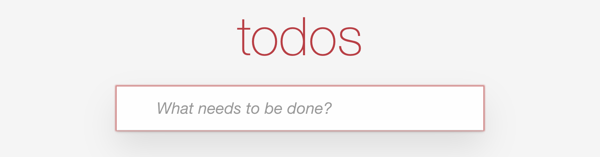

# Setup

## Get the starter

```sh
npx @warp-drive/tutorials@canary todomvc-ember
cd todomvc-ember
pnpm install
pnpm start
```

Open the URL Vite prints. You should see the TodoMVC header over an empty list.
That's right: nothing requests todos until chapter 1.



## What's in the starter

```
todomvc-ember/
  api-worker/     the API, in a service worker; you won't touch it
  app/
    components/   the TodoMVC UI, finished
    data/
      builders/   you write these, next to a shipped utils.ts
      schemas/    the todo schema, finished
      store.ts    the store, finished
    routes/       one per filter: all, active, completed
```

The Ember side is done. You write ***Warp*Drive** code in two places: new files
in `app/data/builders/`, and short additions at `TODO` comments that name the
chapter:

```ts
// TODO (chapter 1): request the todos from /api/todo
```

To find a chapter's `TODO`s:

```sh
grep -rn "chapter 1" app
```

## The API

The app talks to a JSON:API server at `/api`. It runs in the browser as a
service worker, so there's nothing to start, and it keeps your changes across
reloads. It begins with three todos. To reset it, clear the site data in your
browser's developer tools.
