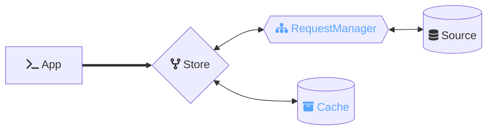
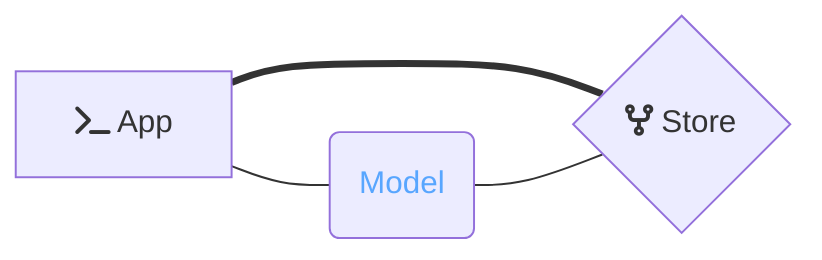

<p align="center">
  
</p>


[](https://discord.gg/zT3asNS
)
[](https://discord.gg/PHBbnWJx5S
)

<p align="center">
  <br>
  <a href="https://warp-drive.io">WarpDrive</a> is the lightweight data library for web apps &mdash;
  <br>
  universal, typed, reactive, and ready to scale.
  <br/><br/>
</p>

---

# @ember-data/store

> [!WARNING]
> **⚠️ This is a legacy package** not recommended for new applications.
>
> Use [@warp-drive/core](https://warp-drive.io/api/@warp-drive/core/) instead.

<p align="center">⚡️ The lightweight reactive data library for JavaScript applications</p>

This package provides [*Ember***Data**](https://github.com/warp-drive-data/warp-drive/)'s `Store` class.

The `Store` coordinates interaction between your application, a [Cache](https://api.emberjs.com/ember-data/release/classes/%3CInterface%3E%20Cache),
and sources of data (such as your API or a local persistence layer) accessed via a [RequestManager](https://github.com/warp-drive-data/warp-drive/tree/main/packages/request).



Optionally, the Store can be configured to hydrate the response data into rich presentation classes.



## Installation

Install using your javascript package manager of choice. For instance with [pnpm](https://pnpm.io/)

```
pnpm add @ember-data/store
```

After installing you will want to configure your first `Store`: add a cache, add a request handler, and tell the store how to present records. The [API docs landing page](https://warp-drive.io/api/@ember-data/store/) walks through each step.

**Tagged Releases**

- 
- 
- 
- 
- 

## Usage

Give the Store a cache and a way to fetch. The sample also uses `@ember-data/request` and `@ember-data/json-api`, so install those alongside this package:

```ts
import Store, { CacheHandler } from '@ember-data/store';
import RequestManager from '@ember-data/request';
import Fetch from '@ember-data/request/fetch';
import Cache from '@ember-data/json-api';

export default class extends Store {
  requestManager = new RequestManager().use([Fetch]).useCache(CacheHandler);

  createCache(capabilities) {
    return new Cache(capabilities);
  }
}
```

Apps on the `ember-data` meta package get this configuration for free. The
[API docs](https://warp-drive.io/api/@ember-data/store/) walk through each piece and how records are presented.

<br>

## Documentation

*Get Started* → [Guides](https://warp-drive.io/guides/)

API docs for this package → [@ember-data/store](https://warp-drive.io/api/@ember-data/store/)

<br>

## Code of Conduct

Refer to the [Code of Conduct](https://github.com/warp-drive-data/warp-drive/blob/main/CODE_OF_CONDUCT.md) for community guidelines and inclusivity.

<br>

### License

This project is licensed under the [MIT License](LICENSE.md).
